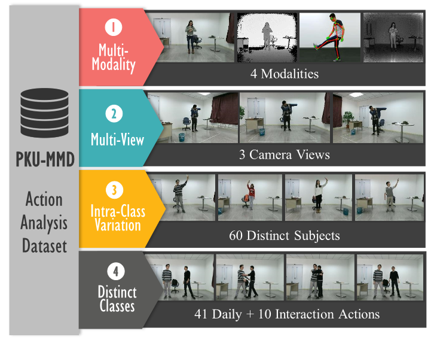
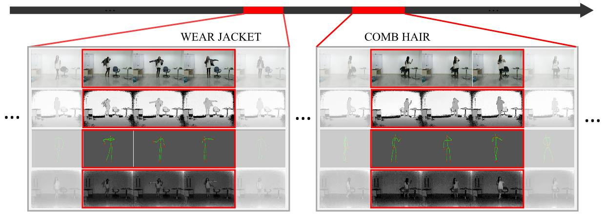
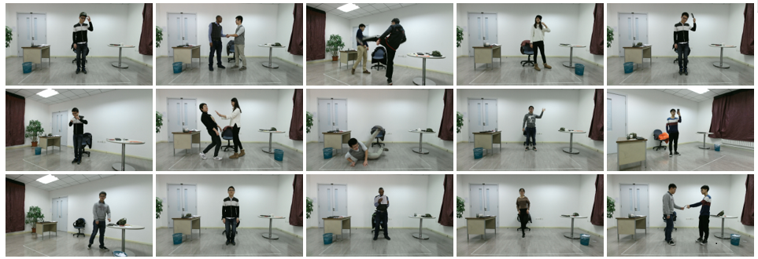

# PKU-MMD: A Large Scale Benchmark for Continuous Multi-Modal Human Action Understanding

<div align=center>
 
 [Spatial and Temporal Resolution Up Conversion Team, ICST, Peking University](http://www.icst.pku.edu.cn/struct)</br>
This dataset is partially funded by Microsoft Research Asia, project ID FY17-RES-THEME-013.


  
Fig.1 PKU Multi-Modality Dataset is a large-scale multi-modalities action detection dataset. This dataset contains 2 phases, phases #1 contains 51 action categories, performed by 66 distinct subjects in 3 camera views.
</div>

## Abstract
PKU-MMD is a new large scale benchmark for continuous multi-modality 3D human action understanding and covers a wide range of complex human activities with well annotated information. PKU-MMD contains 1076 long video sequences in 51 action categories, performed by 66 subjects in three camera views. It contains almost 20,000 action instances and 5.4 million frames in total. Our dataset also provides multi-modality data sources, including RGB, depth, Infrared Radiation and Skeleton. 

# Cite
```
@article{liu2017pku, 
  title={PKU-MMD: A Large Scale Benchmark for Continuous Multi-Modal Human Action Understanding},
  author={Chunhui, Liu and Yueyu, Hu and Yanghao, Li and Sijie, Song and Jiaying, Liu},
  journal={ACM Multimedia workshop},
  year={2017}
}
```

## Resources

**Paper**[ACM Multimedia workshop](https://arxiv.org/abs/1703.07475)*  

**Data**:
      Phase #1: [Google Drive](https://drive.google.com/drive/folders/0B20a4UzO-OyMUVpHaWdGMFY1VDQ?usp=sharing)

**Code**: [Evaluation protocol](https://github.com/ECHO960/PKU-MMD)</div>

**Project Webpage**: http://www.icst.pku.edu.cn/struct/Projects/PKUMMD.html

## Dataset Description
<div class="desp">PKU-MMD is our new large-scale dataset focusing on long continuous sequences action detection and multi-modality action analysis. The dataset is captured via the Kinect v2 sensor.

**Phase #1** contains 1076 long video sequences in 51 action categories, performed by 66 subjects in three camera views. It contains almost 20,000 action instances and 5.4 million frames in total. Each video lasts about 3$\sim$4 minutes (recording ratio set to 30 FPS) and contains approximately 20 action instances. The total scale of our dataset is 5,312,580 frames of 3,000 minutes with 21,545 temporally localized actions.
We choose 51 action classes in total, which are divided into two parts: 41 daily actions (drinking, waving hand, putting on the glassed, _etc._) and 10 interaction actions (hugging, shaking hands, _etc._). 66 distinct subjects are invited for our data collection. Each subjects takes part in 4 daily action videos and 2 interactive action videos.our videos only contain one part of the actions, either daily actions or interaction actions. We design 54 sequences and divide subjects into 9 groups, and each groups randomly choose 6 sequences to perform.

**Phase #2** contains 2000 short video sequences in 49 action categories, performed by 60 subjects in three camera views. Each video lasts about 1$\sim$2 minutes (recording ratio set to 30 FPS) and contains approximately 7 action instances.

We provide 5 categories of resources: depth maps, RGB images, skeleton joints, infrared sequences, and RGB videos.*   Depth maps are sequences of two dimensional depth values in millimeters. The resolution is $512\times424$.*   Joint information consists of 3-dimensional locations of 25 major body joints for detected and tracked human bodies in the scene. We further provide the confidence of each joints point as appendix.*   RGB videos are recorded in the provided resolution of $1920\times1080$.*   Infrared sequences are also collected and stored frame by frame in $512\times424$.</div>


## Data Format

Video Files:
     RGB files are compressed to avi videos in 30 FPS using ffmpeg. File name format is $XXXX-V.avi$ for No. $XXXX$ video file in view $V$. For example $0001-L.avi$ is the first video in left view.

Skeleton Files:
     For each video, there exists a skeleton file $XXXX-V.skeleton$ which contains several lines for frame-level skeleton data. Each line contains $3\times 25\times 2$ float numbers for 3-dimensional locations of 25 major body joints of 2 subjects.

Label Files:
     For each video, there exists a label file named $XXXX-V.label$ illustrating the ground truth labels. Several lines will be given, each line contains 4 integers for $Label, start, end, confidence$ respectively. Note that $confidence$ is either $1$ or $2$ for slight and strong recommendation respectively.

Depth Files:
     A folder is provided for each video which contains several images corresponding to each frame. Each image is in $two-dimensional$ $512\times 424$ png format.

RGB Files:
     A folder is provided for each video which contains several images corresponding to each frame. Each image is in $three-dimensional$ $1920\times 1080$ jpeg format.

Infrared Files:
     A folder is provided for each video which contains several images corresponding to each frame. Each image is in $one-dimensional$ $512\times 424$ png format.

## Metrics

For the detection task, there is a basic criterion to evaluate the overlapping ratio between the predicted action interval $I$ and the ground truth interval $I^{*}$ with a threshold $\theta$. The detection interval is correct when \begin{equation} \frac{|I \cap I^{*}|}{|I \cup I^{*}|} > \theta. \end{equation} where $I \cap I^{*}$ denotes the intersection of the predicted and ground truth intervals and $I \cup I^{*}$ denotes their union. So, with $\theta$, the precision $p(\theta)$ and recall $r(\theta)$ can be calculated.

*   **F1-Score**: With the above criterion to determine a correction detection, the F1-score is defined as \begin{equation} \mbox{F1}(\theta)=2 \cdot \frac{p(\theta) \times r(\theta)}{p(\theta) + r(\theta)}. \end{equation}*   **Interpolated Average Precision (AP)**: With confidence changing, precision and recall values can be plotted to give a precision-recall curve. Note that $r$ is also determined by overlapping confidence $\theta$. The interpolated average precision is calculated by the arithmetic mean of the interpolated precision at each recall level. \begin{equation} \mbox{AP} = \int_{0}^{1} \max_{r' \ge r} p(r') \; \mathrm{d}r. \label{APFORM} \end{equation}
*   **Mean Average Precision of Actions (mAP$_a$)**: AP is used as the metric for evaluating the results on each activity category. The AP is averaged over all the activity categories.
*   **Mean Average Precision of Videos (mAP$_v$)**: AP is used as the metric for evaluating the results on each video. The AP is averaged over all the videos.
**P.S.** For more information on Interpolated Average Precision, please read: [Evaluation of ranked retrieval results](https://nlp.stanford.edu/IR-book/html/htmledition/evaluation-of-ranked-retrieval-results-1.html).</div>


## More Samples

<div align=center>

</div>

Fig.2 From top to bottom, these four rows show RGB, depth, skeleton and IR modalities, respectively.

<div align=center>

</div>

Fig.3 We collect 51 actions performed by 66 subjects, including actions for single and pairs.


Last update: Oct 2017
